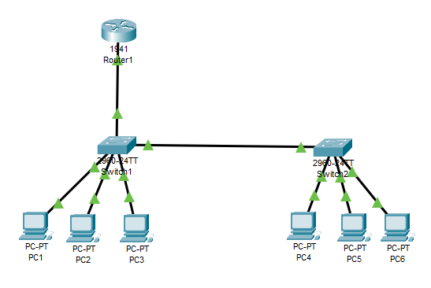
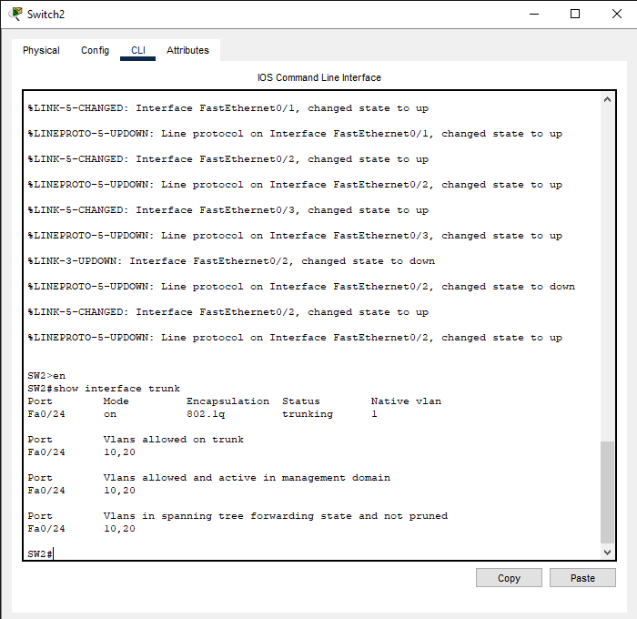

# Networking VLAN & Inter-VLAN Routing Lab




[](LICENSE)

---

## Table of Contents

1. [Lab Objective](#lab-objective)  
2. [Topology Overview](#topology-overview)  
3. [Devices Used](#devices-used)  
4. [Device Configuration Overview](#device-configuration-overview)  
5. [Configuration Files](#configuration-files)  
6. [Verification Steps](#verification-steps)  
7. [Folder Structure](#folder-structure)  
8. [Screenshots](#screenshots)  
9. [License](#license)

---

## Lab Objective

The goal of this lab is to:

- Configure VLANs on multiple Cisco switches.  
- Set up trunk links between switches and a router.  
- Implement inter-VLAN routing to enable communication between VLAN 10 and VLAN 20.  
- Verify the configuration through ping tests and interface status checks.  

---

## Topology Overview

The network topology consists of:

- **2 Cisco Switches (SW1 & SW2)**
- **1 Router (R1)**
- **6 PCs** connected across VLANs 10, 20, and 30.  
- Trunk links between switches and router subinterfaces for inter-VLAN routing.

**VLAN Assignments:**

| VLAN | PCs            | Gateway        |
|------|----------------|----------------|
| 10   | PC1, PC2, PC3  | 192.168.10.1   |
| 20   | PC4, PC5, PC6  | 192.168.20.1   |


---

## Devices Used

- **SW1**: Core Switch  
- **SW2**: Access Switch  
- **R1**: Router (providing inter-VLAN routing)  
- **PC1-PC6**: End devices for testing VLAN connectivity  

---

## Device Configuration Overview

### SW1 (Core Switch)
- VLANs 10, 20 configured  
- Trunk ports on Fa0/23 and Fa0/24  
- Access ports assigned to respective VLANs  

### SW2 (Access Switch)
- VLANs 10, 20 configured  
- Access ports assigned to PCs  
- Trunk port connected to SW1  

### R1 (Router)
- Subinterfaces configured for each VLAN:
  - Gi0/0.10 → VLAN 10, IP 192.168.10.1  
  - Gi0/0.20 → VLAN 20, IP 192.168.20.1  
- Routing enabled for inter-VLAN communication  

---

## Configuration Files

All device configurations are saved in the `configs/` folder:

- `SW1.cfg` → Switch 1 configuration  
- `SW2.cfg` → Switch 2 configuration  
- `R1.cfg`  → Router configuration  

---

## Verification Steps

1. **Ping Tests**  
   - Test connectivity between PCs in the same VLAN and across VLANs.  
   - Example: `PC2 → PC5` (different VLANs).  

2. **Interface Status**  
   - Verify trunk links and VLAN interfaces are up using:  
     ```
     show interfaces trunk
     show vlan brief
     ```

3. **MAC Address Table**  
   - Confirm devices are learned in the correct VLAN using:  
     ```bash
     show mac address-table
     ```

4. **Traceroute**  
   - Optionally, perform `traceroute` to confirm routing between VLANs.  

---

## Folder Structure

networking-vlan-intervlan/
│
├─ configs/ # Device configuration files
├─ screenshots/ # Ping tests, VLAN verification images
├─ docs/ # Documentation (optional)
├─ demo/ # Lab demonstration files (Packet Tracer .pkt)
├─ scripts/ # Automation or helper scripts (if any)
├─ README.md # Project overview
└─ LICENSE # MIT License file


---

## Screenshots

### Ping Verification


### VLAN Configuration


### Interface Trunk Status





---

## License

<a href="LICENSE">
  
</a>

This project is licensed under the [MIT License](LICENSE).


---
